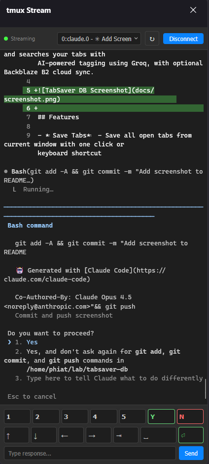

# cc-tmux-stream

Stream tmux pane contents to a Firefox sidebar with full input support. Monitor and control Claude Code sessions or other terminal applications while browsing.



## Features

- Real-time streaming of tmux pane content (~150ms refresh)
- ANSI color support (256-color and true color)
- 500 lines of scrollback history
- Input controls: quick buttons (1-5, Y/N), navigation (arrows, Tab, Space, Enter), control keys (Ctrl-O, Ctrl-C, Ctrl-L), and text input
- Token-based authentication
- Auto-discovery of all tmux sessions/windows/panes
- Smart scroll: auto-follows output, preserves position when reviewing history

## Quick Start

### 1. Build and run the daemon

```bash
cd daemon
cargo build --release
./target/release/tmux-stream
```

On first run, a config file is created at `~/.config/tmux-stream/config.toml` with a generated auth token. The token is displayed on startup - copy it for the extension.

### 2. Install the Firefox extension

**Option A: Signed extension (recommended)**
1. Download `cc-tmux-stream-0.1.1-signed.xpi` from [Releases](https://github.com/phiat/cc-tmux-stream/releases)
2. Open Firefox → File → Open File → select the .xpi
3. Click "Add" when prompted

**Option B: Development (temporary)**
1. Open `about:debugging#/runtime/this-firefox`
2. Click "Load Temporary Add-on..."
3. Select `extension/manifest.json`

### 3. Configure the extension

1. Right-click the tmux-stream icon → Options
2. Paste the token from the daemon output
3. Save

### 4. Use the sidebar

1. View → Sidebar → tmux Stream (or click the extension icon)
2. Click "Connect"
3. Select a tmux pane from the dropdown
4. Use the input buttons to interact with the terminal

## Input Controls

| Button | Action |
|--------|--------|
| 1-5 | Send number key (for Claude prompts) |
| Y / N | Send y/n response |
| ↑ ↓ ← → | Arrow key navigation |
| ⇥ | Tab key |
| ␣ | Space (toggle options) |
| ^O | Ctrl-O (toggle output view in Claude Code) |
| ^C | Ctrl-C (send interrupt signal) |
| ^L | Ctrl-L (clear screen) |
| ⏎ | Enter key |
| Text + Send | Send custom text with Enter |

## Configuration

The daemon config file (`~/.config/tmux-stream/config.toml`):

```toml
[server]
host = "127.0.0.1"
port = 19475

[auth]
token = "your-generated-token"

[capture]
interval_ms = 150
```

## Project Structure

```
├── daemon/                 # Rust WebSocket server (tokio/axum)
│   └── src/
│       ├── main.rs         # Entry point
│       ├── config.rs       # Config file handling
│       ├── protocol.rs     # WebSocket message types
│       ├── server.rs       # WebSocket server
│       └── tmux.rs         # tmux integration
│
├── extension/              # Firefox extension (Manifest V2)
│   ├── sidebar/            # Main sidebar panel
│   ├── options/            # Settings page
│   └── icons/
│
└── docs/                   # Documentation & assets
```

## Requirements

- Rust 1.70+
- Firefox 109+
- tmux running in the same environment as the daemon

## License

MIT
